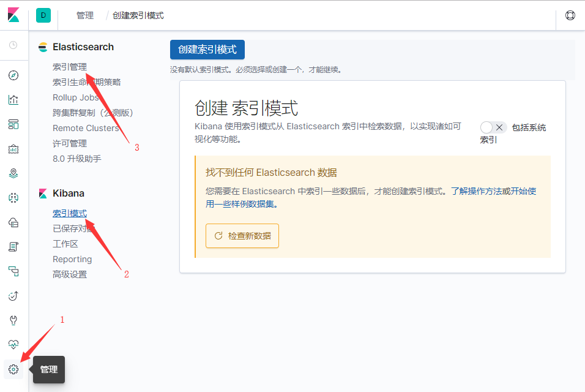
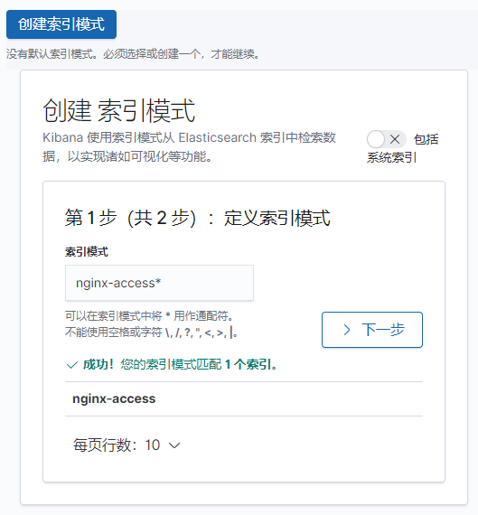
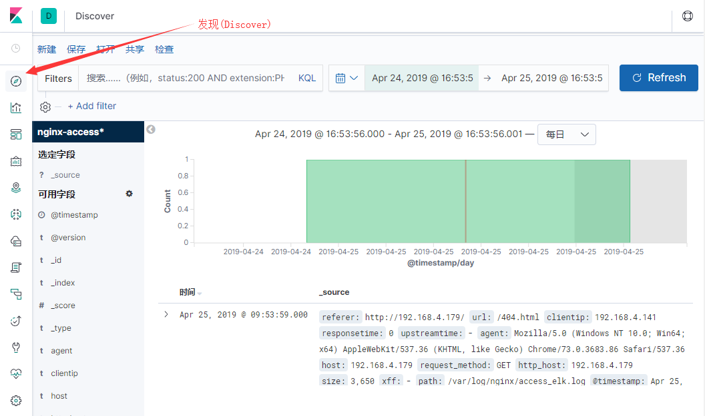

# ELK的安装与使用（CentOSDK）
## 环境准备
### JDK
检查Java版本。
```bash
[root@localhost etc]# java -version
openjdk version "1.8.0_201"
OpenJDK Runtime Environment (build 1.8.0_201-b09)
OpenJDK 64-Bit Server VM (build 25.201-b09, mixed mode)
```
没有安装JDK的话可以使用安装。
```bash
[root@localhost etc]# yum -y install java
```
## 安装ELK准备
### 导入PGP签名
软件使用PGP签名，安装前先导入签名。
```bash
[root@localhost etc]# rpm --import https://artifacts.elastic.co/GPG-KEY-elasticsearch
```
### 下载安装包
直接通过RPM在线安装很慢，先把安装包用迅雷下载下来然后拷到CentOS里。
[Elasticsearch 7.0.0](https://artifacts.elastic.co/downloads/elasticsearch/elasticsearch-7.0.0-x86_64.rpm)
[Logstash 7.0.0](https://artifacts.elastic.co/downloads/logstash/logstash-7.0.0.rpm)
[Kibana 7.0.0](https://artifacts.elastic.co/downloads/kibana/kibana-7.0.0-x86_64.rpm)
### 拷入安装包
可以使用FTP上传。安装vsftpd。
```bash
[root@localhost etc]# yum -y install vsftpd
```
并配置允许root登录。
依次修改下面两个文件，使用#注释掉root。
`/etc/vsftpd/ftpusers`
`/etc/vsftpd/user_list`
重启vsftpd
```bash
[root@localhost etc]# service vsftpd restart
```
使用FileZilla等登录并拷入安装包。
## 安装ElasticSearch
切换到安装包目录安装。
```bash
[root@localhost etc]# rpm --install elasticsearch-7.0.0-x86_64.rpm
```
### 配置ElashticSearch
打开配置文件。
```bash
[root@localhost etc]# nano elasticsearch/elasticsearch.yml
```
增加如下配置：
```yml
network.host: 0.0.0.0
http.port: 9200
http.cors.enabled: true
http.cors.allow-origin: "*" 
node.name: node-1
cluster.initial_master_nodes: ["node-1"]
```
启动ElasticSearch并检查服务状态。
```bash
[root@localhost etc]# service elasticsearch start
[root@localhost etc]# service elasticsearch status
```
此时使用浏览器访问IP:9200或者使用curl命令可以看到返回JSON：
```bash
[root@localhost etc]# curl -X GET "localhost:9200"
```
返回内容：
```json
{
  "name" : "node-1",
  "cluster_name" : "elasticsearch",
  "cluster_uuid" : "2b6bMfBuQWOOBiZJA8tOXw",
  "version" : {
    "number" : "7.0.0",
    "build_flavor" : "default",
    "build_type" : "rpm",
    "build_hash" : "b7e28a7",
    "build_date" : "2019-04-05T22:55:32.697037Z",
    "build_snapshot" : false,
    "lucene_version" : "8.0.0",
    "minimum_wire_compatibility_version" : "6.7.0",
    "minimum_index_compatibility_version" : "6.0.0-beta1"
  },
  "tagline" : "You Know, for Search"
}
```
## 安装Kibana
切换到安装包目录安装。
```bash
[root@localhost etc]# rpm --install kibana-7.0.0-x86_64.rpm
```
### 配置Kibana
打开配置文件。
```bash
[root@localhost etc]# nano kibana/kibana.yml
```
增加如下配置：
```yml
server.host: "0.0.0.0"
```
启动Kibana并检查服务状态。
```bash
[root@localhost etc]# service kibana start
kibana started
[root@localhost etc]# service kibana status
kibana is running
```
使用浏览器访问IP:5601可以看到Kibana界面。
### 启用官方中文界面
打开配置文件。
```bash
[root@localhost etc]# nano kibana/kibana.yml
```
增加如下配置。
```yml
i18n.locale: "zh-CN"
```
重启Kibana。
```bash
[root@localhost etc]# service kibana restart
kibana stopped.
kibana started
```
## 安装Logstash
切换到安装包目录安装。
```bash
[root@localhost etc]# rpm --install logstash-7.0.0.rpm
 ```
 ### 配置Logstash
 打开配置文件。
 ```bash
 [root@localhost etc]# nano logstash/logstash.yml
```
确认如下配置：
```yml
path.data: /var/lib/logstash
path.config: /etc/logstash/conf.d
path.logs: /var/log/logstash
```
配置Logstash不以服务启动，而是手动通过命令启动，方便控制。同时创建软链接 ，使得能从/usr/share/logstash下读取配置。
```bash
[root@localhost etc]# systemctl disable logstash.service
[root@localhost etc]# ln -s /etc/logstash /usr/share/logstash/config
```
上面配置里注意第二行，定义了一个配置目录，涉及到需要收集多个日志时可以把配置都放在这个目录下。
## 使用ELK
以收集Nginx日志为例，此例将Nginx搭在ELK同一台机器上，当Nginx不在同一台机器上时，可以使用rsyslog等方式将日志传输到ELK机器上，也可使用ftp等方式。
### 安装Nginx
```bash
[root@localhost etc]# yum -y install nginx
```
### 配置Nginx日志
将日志配置成JSON格式方便使用。打开Nginx配置文件：
```bash
[root@localhost etc]# nano nginx/nginx.conf
```
增加如下配置：
```nginx
log_format json '{"@timestamp":"$time_iso8601",'
                 '"host":"$server_addr",'
                 '"request_method": "$request_method", '
                 '"clientip":"$remote_addr",'
                 '"size":$body_bytes_sent,'
                 '"responsetime":$request_time,'
                 '"upstreamtime":"$upstream_response_time",'
                 '"upstreamhost":"$upstream_addr",'
                 '"http_host":"$host",'
                 '"url":"$uri",'
                 '"xff":"$http_x_forwarded_for",'
                 '"referer":"$http_referer",'
                 '"agent":"$http_user_agent",'
                 '"status":"$status"}';
```
具体含义如下：
`timestamp`：日志的时间戳。
`host`：nginx所在主机IP。
`request_method`：请求类型（POST，GET）
`clientip`：前端ip。
`size`：请求大小。
`responsetime`：请求响应时间。
`upstreamtime`：后端相应请求时间。
`upstreamhost`：后端服务器IP。
`http_host`：域名。
`url`：请求的接口。
`xff`：用户IP。
`referer`：完整请求地址。
`agent`：客户端类型。
`status`：状态码。

继续在Nginx配置文件增加或者更改为如下内容，指定生成日志文件：
```nginx
access_log /var/log/nginx/access_elk.log json;
```
因为Nginx搭建在本机，不涉及日志文件的传送。多个机器之间日志传送可看附录的rsyslog部分。（未完成）
### 配置Logstash
配置Logstash用于收集Nginx日志并发送给Elasticsearch。创建如下配置文件：
```bash
[root@localhost etc]# nano /etc/logstash/conf.d/nginx.conf
```
添加如下配置，指定了读取的日志文件，格式为JSON，输出到ElasticSearch，并创建索引"nginx-access"。
```json
input {
    file {
        path => "/var/log/nginx/access_elk.log"
        codec => "json"
    }
}
filter {

}
output {
    elasticsearch {
        hosts => ["127.0.0.1:9200"]
        index => "nginx-access"
    }
}
```
### 启动Logstash
按照给定的配置文件启动Logstash。
```bash
[root@localhost etc]# /usr/share/logstash/bin/logstash -f /etc/logstash/conf.d/nginx.conf
```
### 使用Kibana查看日志
使用浏览器访问IP:9200打开Kibana。
在左侧导航点管理(1)，子菜单里的索引模式(2)用于创建索引，索引管理(3)可以查看已创建的索引。

点击索引模式，右侧可以创建索引模式。第一次在这里可能会如图显示找不到Elasticsearch数据，可以访问一下Nginx服务IP:80产生一些日志数据。
再次刷新就会显示Logstash创建的`nginx-access`索引，输入匹配条件`nginx-access*`点击下一步。时间筛选选择`@timestamp`，点击创建索引模式完成创建。

点击左侧导航的发现(Discover)，可以查看到收集的日志，如果没有看到，可以设置右上角的时间范围并刷新。

上图中，在左侧选定字段和可用字段中可以设置右侧表格查看的字段。

